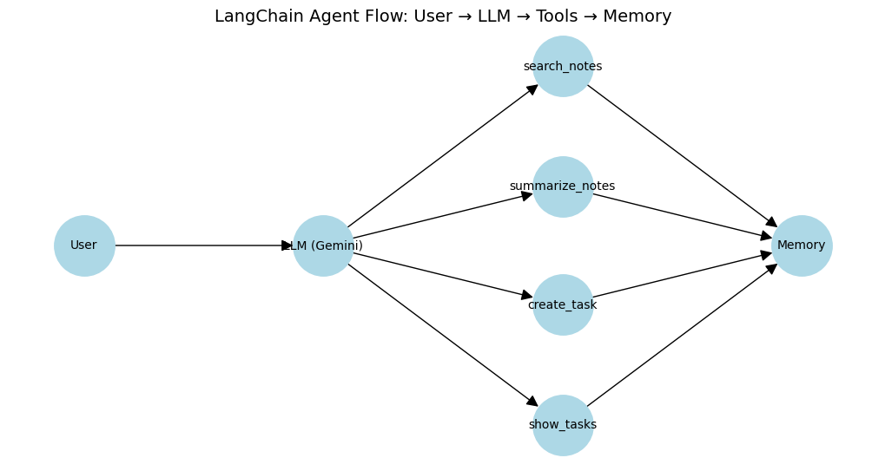

# LangChain Gemini Agent Demo

This is a **beginner-friendly demo** of a LangChain agent built with **Google Gemini (Gemini 2.5 Pro)**.  

The agent can:
- Summarize notes  
- Search through text  
- Help create tasks (with human confirmation)  
- Keep conversation context with memory  
- Visualize its internal flow using a simple graph

## Features

- **User-friendly**: paste your note directly in Colab and interact naturally.  
- **Tool-enabled**: modular tools using LangChain `@tool` functions.  
- **Memory-aware**: conversation history ensures coherent multi-turn interactions.  
- **Visualization**: static graph showing `User → LLM → Tools → Memory`.  

## Usage

1. Open the notebook `LangChain_Gemini_Agent_Demo.ipynb` in Google Colab.  
2. Paste your note when prompted.  
3. Interact via natural language: ask the agent to summarize, search, create tasks, or view tasks.  
4. Observe memory and graph visualization for internal flow.

## Dependencies

- langchain  
- langchain-google-genai  
- google-genai  
- pypdf (optional, if parsing PDFs)  
- matplotlib, networkx (for visualization)

## Screenshot / Flow Diagram

## Notes

This project is intended as a **learning exercise** to demonstrate small-scale AI agent design with routing, memory, tools, and visualization.
